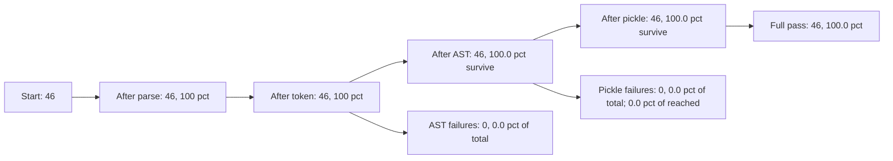
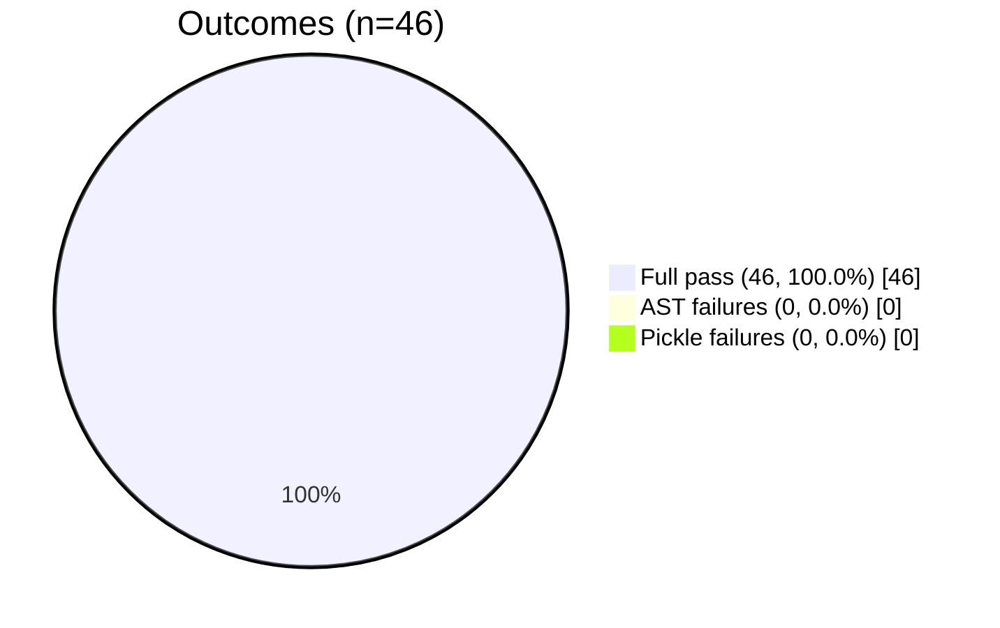

# Compliance Report

## Summary

| Category | Count |
|----------|-------|
| Good files total | 46 |
| Parse errors | 0 |
| Token failures | 0 |
| AST failures | 0 |
| Pickle failures | 0 |
| **Full pass** | **46** |

| Category | Count |
|----------|-------|
| Bad files total | 11 |
| Correctly rejected | 11 |
| Should reject but didn't | 0 |

---

## Parse Errors - ALL PASS

---

## Token Failures - ALL PASS

---

## AST Failures - ALL PASS

---

## Pickle Failures - ALL PASS

---

## Bad Files - ALL REJECTED
